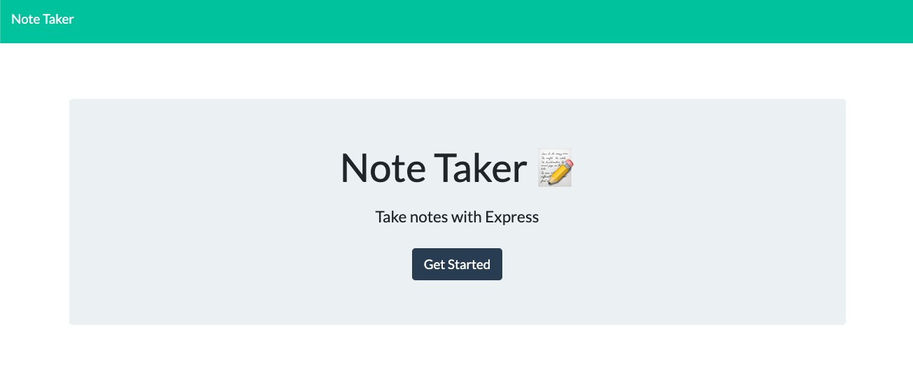
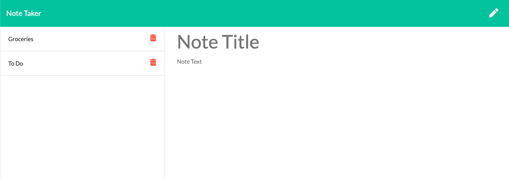

# note-taker

  ## The Repository
  Link to repository: https://github.com/awebb8/employee-summary-template
  Link to the deployed Heroku site: https://obscure-island-16380.herokuapp.com/ 

  ## About
  The Note Taker application can be used to write, save, and delete notes. This application uses an express backend and saves and retrieves note data from a JSON file. The Note Taker application allows users to take notes so that they can keep track of information and have it available when needed.

  
  

  ## Table of Contents
  * [Installation](#installation)
  * [Usage](#usage)
  * [License](#License)
  * [Credits](#Credits)

  ## Installation
  Clone the employee-summary-template repository from GitHub.  Then utilize "npm install" to install Inquirer and UUID. For more information on installing and using Inquirer, visit https://www.npmjs.com/package/inquirer#installation.  For more information on installing and using UUID, visit https://www.npmjs.com/package/uuid.

  ## Usage
  The Note Taker application was created for a user to be able to write and save notes and delete previously written notes so that they can stay organized.  To create and save notes, go to the deployed Heroku site, click the "Get Started" button, type a title in the "Note Title" field and a message in the "Note Text" field and click the save icon in the top-right corner.  The save icon will not appear if either the "Note Title" or "Note Text" fields are empty.  To view previously saved notes, click a note title on the left sidebar of the application.  To delete a previously saved note, click the trash icon near the note title on the left sidebar.

  ## License
  This project is licensed under the terms of the MIT License.

  ## Credits
  The application frontend was created by Trilogy Education Services.
